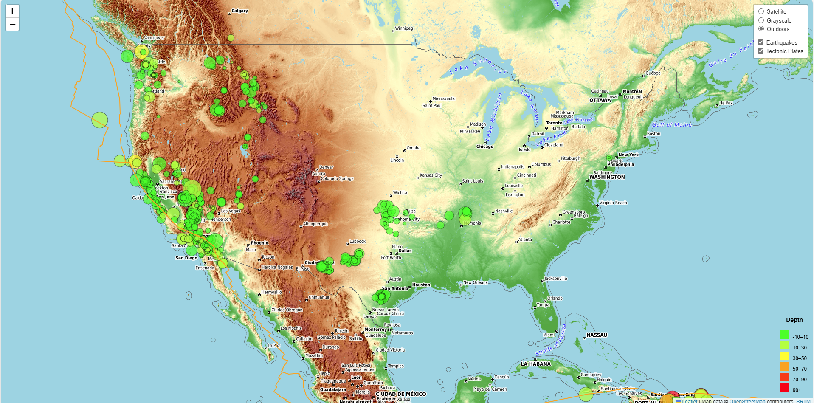
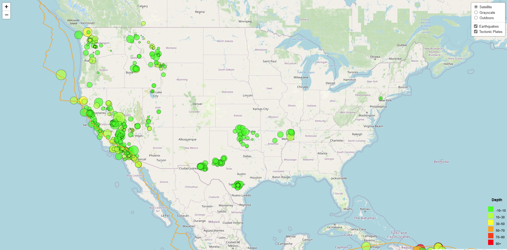

# leaflet-challenge

Module 15 Challenge

## Leaflet Part 1 - Create the earthquake visualization

* Visualize global earthquake activity using JSON data from the USGS website.
* Circular markers represent earthquake locations that occurred in the past seven days.
* The size of the markers correlates with the earthquake's magnitude — larger markers indicate stronger earthquakes.
* The color of the markers reflects the depth of the earthquakes, with a color-coded legend displayed in the bottom right corner of the map.
* Clicking on a marker opens a pop-up showing detailed information about the earthquake, including its location, date and time, magnitude, and depth.

